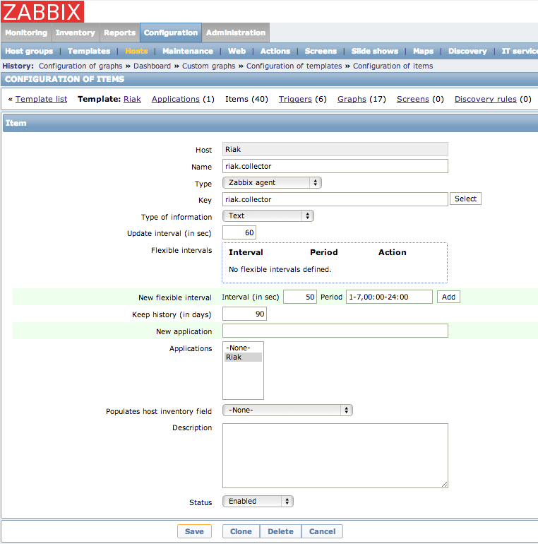

# Monitoring Riak with Zabbix

This document describes how to use the files included in this repository to monitor your Riak infrastructure.

Here is a description of the following components:

## riak_stats.py

This script should be placed in /usr/local/bin.  It performs the following actions:

1. collects information from the Riak stats JSON interface
2. compiles those stats in a format that is acceptable for zabbix_sender
3. writes a temporary file to /tmp/riak_stats.txt
4. calls zabbix sender program to send data to zabbix server

zabbix_sender requires a hostname as one of the arguments.  This script will attempt to determine the zabbix hostname as defined in zabbix-agentd.conf by using the confobj python module.  If that module is not installed, it will use the platform.node() python call to determine the hostname.

## riak.conf

This file should be placed in /etc/zabbix-agent.d/riak.conf.  All it does is define a UserParameter to call the riak_stats.py script:

	UserParameter=riak.collector, /usr/local/bin/riak_stats.py
	
## riak_zabbix_template.xml

Importing this file will create a Riak template in your Zabbix installation with a number 
of different Zabbix items and graphs.  Link it to your Riak servers to start collect metrics.	

# Configure monitoring

By change the interval of the riak.collector item, you can control the frequency of the stats collection:

Currently this script pushes all data found in the Riak stats enviornment to Riak, but only the items registered in the template with make it into Zabbix. If you want to take a peak at other items to add to the Riak template, please take a look at /tmp/riak_stats.txt on one of the Riak nodes.